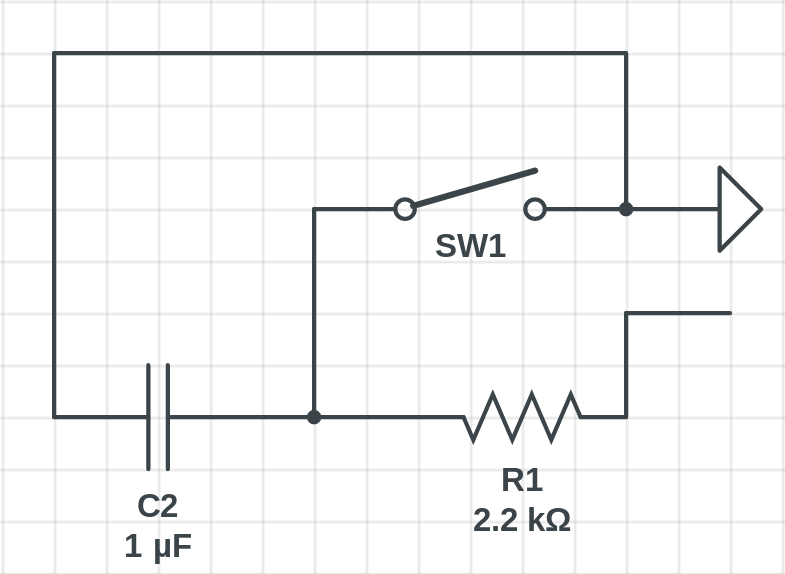

RC stands for **r**esistor and **c**apacitor. RC circuits have a variety of functions, one of which is to use them to help digital devices read analogue components.
In the timing circuit illustrated below, a 2.2kΩ resistor has been placed in series with a 1µF capacitor. They are connected to a 3.3V power supply. The switch in the circuit can be pushed to short the circuit and thereby **earth** both the capacitor and the resistor.

*[Resistor]: A component that resists the flow of current. Resistance is measured in ohms (Ω).
*[Capacitor]: A component that can store charge. Capacitance is measured in farads (F).

To understand what happens in this circuit, you can watch this video, or read the explanation below.

<iframe width="560" height="315" src="https://www.youtube.com/embed/sNn3vjEU_H0" frameborder="0" allowfullscreen></iframe>

When the switch is open, current can flow though the resistor and the capacitor. The capacitor starts to store charge immediately. This causes the voltage across the capacitor to increase. Eventually, the capacitor is fully charged and the voltage across it will match that of the supply - in this case 3.3V.

Closing the switch shorts the circuit, and causes charge to flow straight to earth or ground. As a consequence, the capacitor rapidly discharges, which causes the voltage to drop to zero almost instantly. Opening the switch will start the process of charging the capacitor all over again.

The rate at which the capacitor charges is constant as long as the resistance is constant. Using a resistor with a larger resistance will case the charging process to slow down. Using a smaller resistance will make charging faster.

If you can measure the time it takes for the capacitor to charge, you can fairly accurately calculate the resistance of the resistor. This means that you could use this type of circuit to measure the resistance of a component such as a light-dependent resistor, a thermistor or a potentiometer. All these components have variable resistances.
